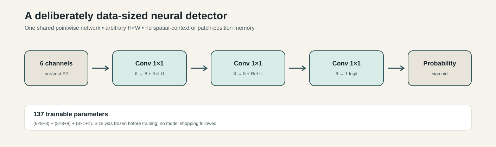
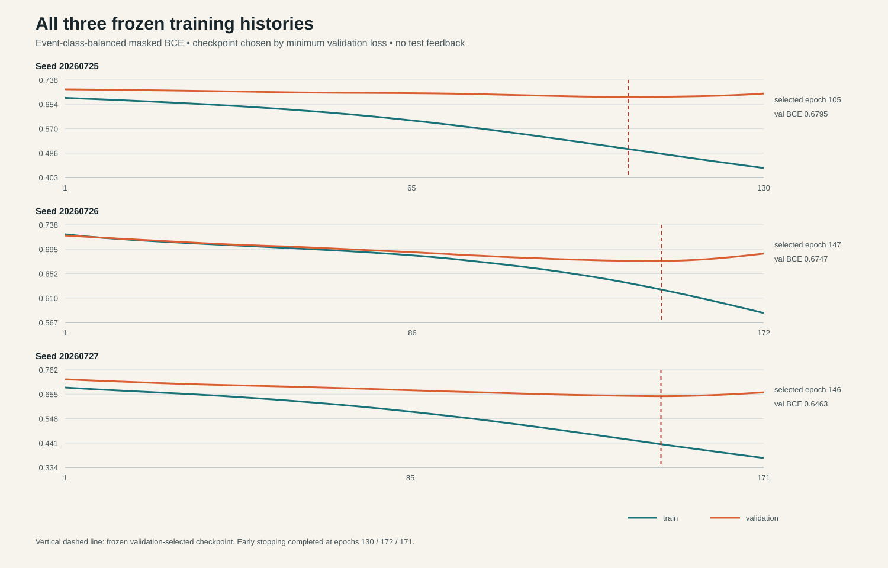
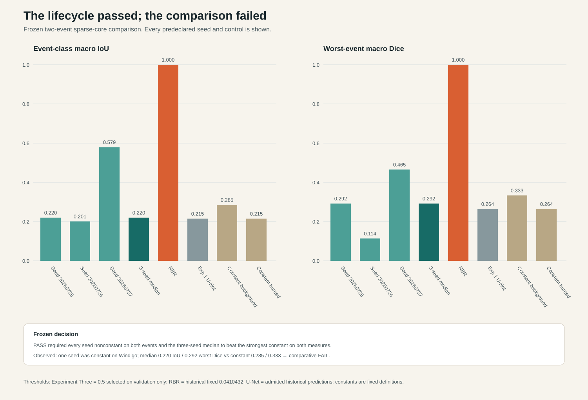

# BurnLens Experiment Three reviewer guide

## Thirty-second result

BurnLens Experiment Three completed a real neural-network lifecycle and did not
produce a competitively reliable model. The 137-parameter detector was built,
preflighted, trained for three fixed seeds, checkpointed, safely reloaded,
evaluated once, packaged, and exactly replayed: lifecycle `PASS`. Under the
predeclared all-seed rule, it failed to beat the strongest constant-class
control and one seed was constant on one event: comparative `FAIL`.

That is the intended honest endpoint. Seed `20260727` was substantially better,
but selecting it after observing the test would be best-seed shopping. No
threshold, architecture, seed, event, or decision rule changed after the test.

## Two-minute evidence path

1. The model was intentionally tiny because the inherited benchmark has only
   six independent split events and 287 sparse scored prototype-core pixels.
2. Every training history is retained. The validation-selected checkpoints are
   marked below; test evidence played no role in selection.
3. The known Ward Creek/Windigo test was opened exactly once for all seeds and
   controls. Events—not pixels—are the independent units.
4. The three-seed median macro IoU was `0.2201`; median worst-event macro Dice
   was `0.2919`. The strongest constant-control values were `0.2853` and
   `0.3333`, so the frozen decision is `FAIL`.
5. RBR reproduced perfect sparse-core agreement, but the labels derive from the
   same spectral-change family. That is structural agreement, not independent
   field accuracy.

## What the visuals do and do not show

The public SVGs above contain only repository-authored architecture and already
published numerical evidence. They contain no satellite pixels, label arrays,
model weights, predictions, or geospatial rasters.

The required four-patch input/reference/RBR/U-Net/new-model probability and
error panel exists in controlled custody at 5360×2076 pixels, SHA-256
`87d7653fcc39abb7d290a36daf1d6fa1372f46f092970a936c10024269ff96bf`.
It passed direct visual inspection, and all 36 probability/class/error GeoTIFFs
reopened exactly. Those bytes are not public release assets because Milestone 1
authorized controlled local use, not benchmark-byte redistribution.

## Five-minute audit path

- [Exact public evaluation record](../../records/evaluation/EXPERIMENT-THREE-M5-RETROSPECTIVE-EVALUATION-2026-001.json)
- [Frozen protocol](../../protocol/EXPERIMENT-THREE-FROZEN-PROTOCOL-2026-001.json)
- [Training record](../../records/training/EXPERIMENT-THREE-M4-FROZEN-TRAINING-2026-001.json)
- [Benchmark card](../benchmark/BENCHMARK-CARD.md)
- [Model card](../model-card/MODEL-CARD.md)
- [Limitations](../limitations/LIMITATIONS.md)
- [Reproducibility guide](../reproducibility/REPRODUCIBILITY.md)

This is a portfolio research case study, not operational wildfire guidance,
official mapping, field validation, or a generalization claim.
